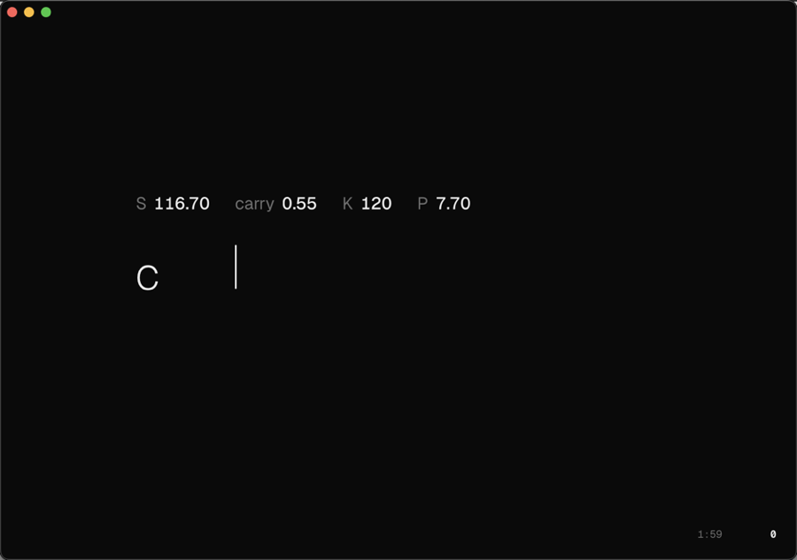
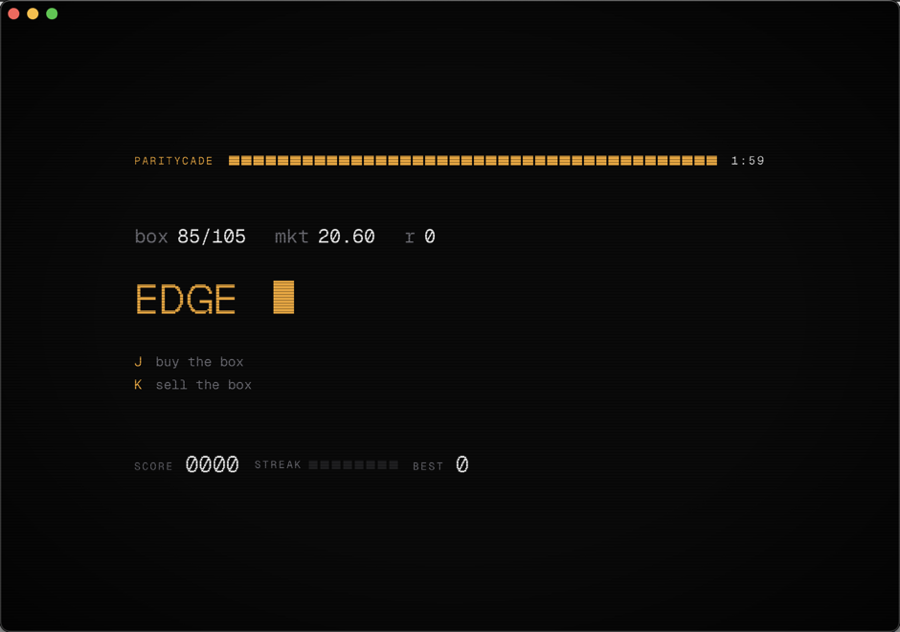

# Paritymac

A put–call parity speed drill for macOS, in the spirit of [Zetamac](https://arithmetic.zetamac.com).

Seven levels, two skins. No network, no dependencies, no build step.

| `minimal` | `arcade` |
|---|---|
|  |  |

## Install

Needs macOS 12+ and the Xcode command line tools (`xcode-select --install`).

```bash
git clone https://github.com/TLXyloph/paritymac
cd paritymac
./scripts/build-app.sh            # installs to /Applications
./scripts/build-app.sh ~/Desktop  # or elsewhere
```

A local build carries no quarantine flag, so it opens immediately. See
[Distribution](#distribution) for disk images.

## The drill

Parity is `C + K·DF = P + S`. Each problem quotes all but one leg and asks for
the missing one, rotating which leg is hidden.

| # | level | relation |
|---|---|---|
| 1 | missing leg, clean integers | `C − P = S − K`, whole dollars |
| 2 | missing leg, ugly numbers | the same, carrying cents |
| 3 | forward, not spot | `C − P = F − K`, with `F` quoted or given as spot plus carry |
| 4 | rates, simple interest | `C − P = S − K + K·r·T` |
| 5 | dividends | `C − P = S − PV(div) − K` |
| 6 | arb direction | all four legs quoted off parity — name the edge and the trade |
| 7 | boxes | a `K1/K2` box is worth `K2 − K1` at zero rates — buy it or sell it |

Values are generated in integer cents, so answers always land on a clean 0.05
increment. Levels toggle independently; level 1 is off by default, being a
warm-up.

Levels 6 and 7 want a magnitude and a direction: type the edge, then press the
key naming the trade. Direction is binary — the sign of `(C−P) − (S−K·DF)`
determines the trade completely. A wrong key holds the problem, so advancing
always means you were right.

## Keys

| | |
|---|---|
| `1`–`7` | toggle levels |
| `⏎` | start, or run again |
| `esc` | back |
| `h` | history |
| `j` `k` | name the trade, on levels 6 and 7 |

`submit` switches between advancing the moment a typed answer matches and
requiring `⏎`.

## History

Each run records score, rate, duration, level set, best streak, and per-level
solved / missed / elapsed. The history screen shows recent runs and lifetime
average time per level. Bests are scoped to duration plus level set, so a short
round never outranks a long one. Stored locally; nothing leaves the machine.

## Skins

A skin is one CSS file and one line of registration:

```js
// src/skins/myskin/skin.js
PCP.skin({ id: 'myskin', name: 'my skin', css: 'skins/myskin/skin.css' });
```

Copy `src/skins/minimal/skin.css`, add a `<script>` line to `src/index.html`,
and it appears in the menu. Skins style a fixed DOM rather than supplying their
own markup, so a skin cannot break the drill. Slot contract: [AGENTS.md](AGENTS.md).

## Distribution

```bash
./scripts/make-dmg.sh             # -> dist/Paritymac-<version>.dmg
```

A downloaded app carries a quarantine flag, and macOS will refuse to open it
unless it is **notarised** — signed with a Developer ID certificate and scanned
by Apple. That requires an Apple Developer Program membership ($99/year). There
is no free workaround: an ad-hoc build shows *"cannot be opened because Apple
cannot check it for malicious software"*, and users must right-click → Open, or
approve it under Privacy & Security.

With a membership, the same script produces a disk image that opens first try:

```bash
xcrun notarytool store-credentials paritymac \
  --apple-id you@example.com --team-id TEAMID --password <app-specific-password>

SIGN_ID="Developer ID Application: Your Name (TEAMID)" \
NOTARY_PROFILE=paritymac ./scripts/make-dmg.sh
```

That signs with the hardened runtime, submits the image to Apple for malware
scanning, and staples the ticket so it verifies offline.

## Development

```bash
node tests/levels.test.js
```

Checks every level against its own parity relation across 20,000 generated
problems each, plus the worked examples, and asserts answers are positive, land
on the 0.05 grid, and never quote an option below intrinsic value. Needs only
`node`.

For CSS iteration: `cd src && python3 -m http.server 8731`.

The app is a `WKWebView` serving its bundle over a custom `pcp://` scheme.
`file://` origins are opaque in WKWebView and will not persist `localStorage`,
which would discard settings and history on every launch.

## License

Code is [MIT](LICENSE). The bundled [Geist](https://vercel.com/font) faces are
SIL OFL 1.1 — a separate license covering only the font files, which requires
its text to travel with them. Keep [`src/fonts/OFL.txt`](src/fonts/OFL.txt) in
any fork.
